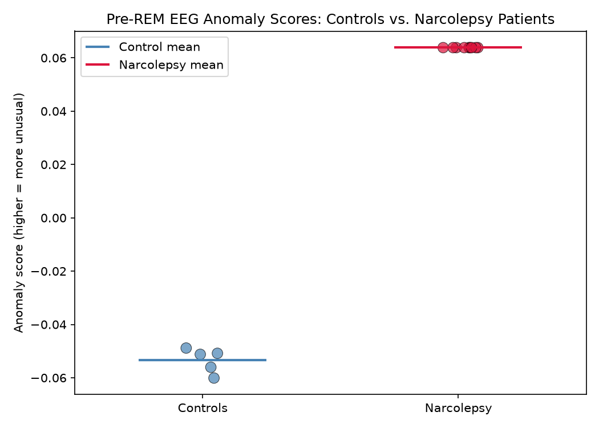
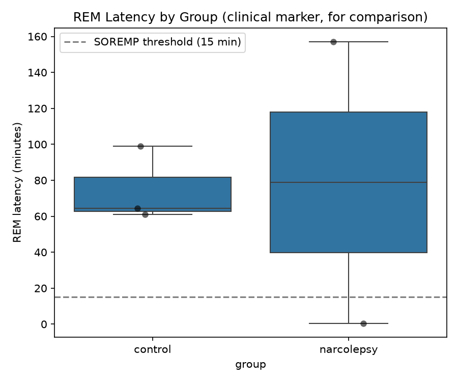
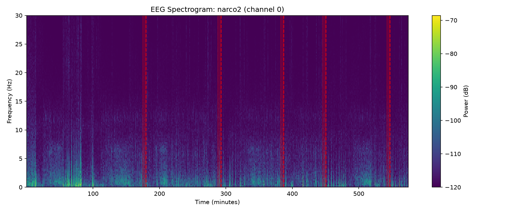

# REM-Onset Anomaly Detection in Narcolepsy

Unsupervised anomaly detection for identifying abnormal REM-sleep-onset
patterns in EEG, using narcolepsy as the clinical motivating case. Also 
includes future applications of this program. 
Built with assistance from Claude Code.

## Problem

Narcolepsy is a chronic neurological sleep disorder marked by abnormally
short REM sleep latency and sleep-onset REM periods (SOREMPs), meaning
the brain enters REM sleep much sooner after sleep onset than is typical.
These patterns are part of the clinical diagnostic criteria (via the
Multiple Sleep Latency Test) but are normally only assessed manually,
by a provider scoring an overnight polysomnography (a sleep study that
records bodily functions during sleep).

This project asks: **can we automatically flag EEG segments that look
abnormal relative to normal pre-REM-transition brain activity**, using
only unsupervised learning (no pre-classified narcolepsy vs. typical
data)?

Why? Because the abnormal brain activity that signals an impending
narcoleptic episode differs from patient to patient. Ultimately, a
patient-specific warning system, one calibrated to each person's own
baseline, would be the ideal way to flag an individual's coming
episode. This project takes a first step toward that goal: it tests
whether a population-level anomaly model (trained on healthy controls'
"normal" pre-REM EEG) can meaningfully separate narcolepsy patients
from controls at all, before attempting the harder problem of
per-patient personalization. See **Future work** below for how this
project could evolve into an actual patient-specific system.

## Approach

1. Train an anomaly-detection model (Isolation Forest) on EEG band-power
   features extracted from the minutes leading into REM-sleep transitions
   in **healthy control** subjects only -- this defines what a "normal"
   pre-REM EEG pattern looks like. The model never sees narcolepsy data
   during training.
2. Run the trained model on pre-REM windows from **narcolepsy patients**
   and measure how often/how strongly those windows are flagged as
   anomalous, compared to held-out controls.
3. Compare against the known clinical marker (REM latency) as a sanity
   check and complementary signal.

Feature extraction converts each raw EEG window into 5 numbers: the
relative power in each of the 4 standard EEG frequency bands (delta,
theta, alpha, beta) plus the theta/alpha ratio, a commonly used
drowsiness indicator in sleep EEG research.

## Dataset

[CAP Sleep Database](https://physionet.org/content/capslpdb/1.0.0/) on
PhysioNet: free, no credentialing required. Includes full-night
polysomnography (EEG, EOG, EMG) with expert-scored sleep stages for
multiple subject groups, including narcolepsy patients and healthy
controls.

Naming convention: `n1`-`n16` are healthy controls, `narco1`-`narco5`
are narcolepsy patients. Note the `.txt` annotation files are **not**
perfectly consistent in format between subjects (see `data_loader.py`
for the token-based parser this required).

**Setup:**
```bash
# From PhysioNet, download the .edf and .txt (annotation) files for the
# subjects you want into the data/ folder, e.g.:
#   data/n16.edf     data/n16.txt
#   data/narco2.edf  data/narco2.txt
```
Data files are not committed to this repo (see `.gitignore`) you can
download them yourself from PhysioNet.

## Results

This is a small-scale proof of concept -- **3 control subjects (n16,
n12, n7) and 2 narcolepsy patients (narco5, narco2)**. The results below
demonstrate that the pipeline works end-to-end and shows a real signal
on this data, not a statistically validated clinical finding.

### Anomaly scores: clean separation between groups



Held-out control windows scored a mean of **-0.053**; narcolepsy
patient windows scored a mean of **+0.064**. All 9 narcolepsy windows
(from 2 independent patients) were flagged as anomalous relative to the
control baseline, with no overlap between the two groups' score ranges.

### REM latency: the known clinical marker, for comparison



Narcolepsy patients showed both a higher median REM latency and far
wider spread than controls in this small sample -- including one
observation near 0 minutes (consistent with a SOREMP) and one well
above 150 minutes. This illustrates real clinical heterogeneity:
narcolepsy does not produce one uniform EEG signature across patients,
which is part of why "different patients need different baselines" (see
Problem, above) and why an anomaly-detection framing suits this problem
better than a rigid rule like "REM latency < 15 minutes."

### Spectrogram: visual sanity check



REM transitions (red dashed lines) for narco2 across a full night's
recording, confirming the detected transitions land where the
underlying EEG signal actually shows the expected pattern shifts.

## Honest limitations

- **Very small sample size.** 3 controls and 2 narcolepsy patients is
  not enough to draw statistically valid conclusions. The clean score
  separation shown above is a promising proof of concept, not a
  validated finding -- it could reflect a real narcolepsy signal, or it
  could partly reflect person-specific EEG differences unrelated to
  narcolepsy (see the population-vs-personalized point in Problem and
  Future work).
- **Population-level, not yet patient-personalized.** As discussed
  above, this is the core open gap between what's built and what an
  ideal system would be. Band-power *ratios* (rather than absolute
  power) partially reduce cross-subject amplitude differences, but
  don't eliminate the underlying issue.

## Future work: personalized, wearable-based detection

The current approach flags anomalies relative to a population-level
baseline (learned from healthy controls) rather than a
patient-specific baseline. This is a real limitation: individual EEG
signatures vary enough (skull anatomy, electrode placement, age, etc.)
that some flagged anomalies may reflect normal individual variation
rather than a narcolepsy-specific signal. A more clinically realistic
extension would use a two-stage, personalized detection loop:

1. **Bootstrap with the population model.** A new patient wears a
   continuous EEG device (e.g. a consumer-grade EEG headband) with no
   personal data yet available. The population-trained anomaly model
   (this project) is used to flag potential episodes.
2. **Confirm in real time.** When the population model flags a
   deviation, the device prompts the patient to respond (e.g. tap a
   button) to confirm they're awake. No response is treated as a
   probable sleep-onset event.
3. **Build a personalized model over time.** EEG windows preceding
   confirmed sleep-onset events become that patient's own labeled
   training data. As confirmed events accumulate, a per-patient model
   can supplement or replace the population baseline, tailored to that
   individual's actual precursor patterns.

**Why this isn't implemented here:** this project uses a static,
retrospective, clinical-grade PSG dataset (CAP Sleep Database). The
personalized loop above requires infrastructure this project doesn't
have: a live/streaming EEG pipeline, a real-time user-response/prompt
system, and validation on consumer-grade EEG hardware (fewer channels,
noisier signal than clinical PSG). None of the underlying hardware is
missing -- consumer EEG headbands and confirm-or-assume alert systems
already exist independently -- but no existing system combines them
into this specific detection-and-personalization loop, and no dataset
exists yet to test it. That combination is a natural next project
rather than an extension of this one.

Other reasonable next steps at smaller scope: expand to more subjects
from the CAP database to test whether the score separation holds at
scale; try an autoencoder-based anomaly detector as a deep-learning
alternative to Isolation Forest; add within-subject feature
normalization to further reduce individual-baseline effects.

## Important caveat

This is a research/educational project using retrospective, lab-recorded
overnight PSG data. It is **not** a real-time or wearable-device episode
predictor, and is not validated for any clinical use. The goal is to
demonstrate a signal-processing + anomaly-detection pipeline on a
genuine neurological dataset, not to produce a diagnostic tool.

## Project structure
```
├── src/
│   ├── data_loader.py       # Load EDF recordings + sleep-stage annotations
│   ├── rem_transitions.py   # Detect REM onsets, extract pre-REM EEG windows
│   ├── features.py          # Band-power feature extraction
│   ├── anomaly_model.py     # Isolation Forest training/scoring
│   └── evaluate.py          # Full pipeline run + result plots
├── outputs/                  # Generated plots (score distributions, latency, spectrogram)
├── notebooks/                # exploratory analysis
├── tests/                    # unit tests
├── data/                      # (gitignored) raw PhysioNet downloads go here
└── requirements.txt
```

## Setup
```bash
pip install -r requirements.txt
python src/data_loader.py       # sanity-check data loading
python src/rem_transitions.py   # sanity-check REM transition detection
python src/evaluate.py          # run full pipeline, generate result plots
```
